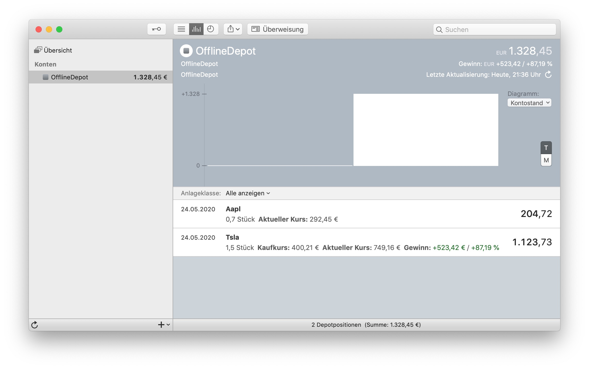
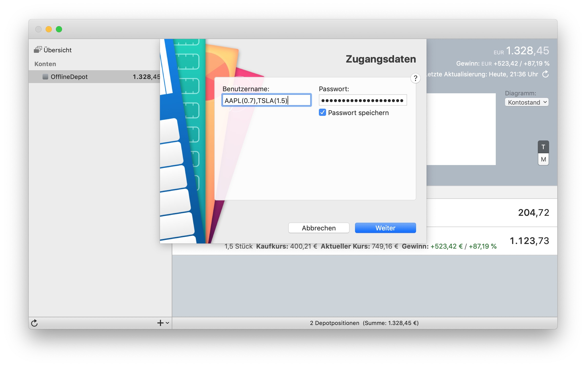

# StockPortfolio for MoneyMoney
Create a custom portfolio with US stocks and fetch the current stock value via finnhub.io

## Setup

1. Download the extension via the [GitHub releases page](https://github.com/tobiasdueser/MoneyMoney-StockPortfolio/releases/tag/v1.1)
2. Once downloaded, move `StockPortfolio.lua` to your MoneyMoney Extensions folder.
3. Create a free [finnhub.io](https://finnhub.io/) account and copy the API-key from [finnhub.io/dashboard](https://finnhub.io/dashboard)
4. Add a new account with the type `StockPortfolio`
5. Use the stock symbols comma seperated with the number of shares in brackets as user name. Example: `AAPL(0.7),TSLA(1.5)`
6. Use the free Finnhub API key as password. Example: `5r8ufep1br56mlvrhj6g`

### Bonus
Add the buying rates in MoneyMoney via right click on the stock to display the profits.

### Requirements
You need at least version 2.4.0 or a beta version of MoneyMoney.